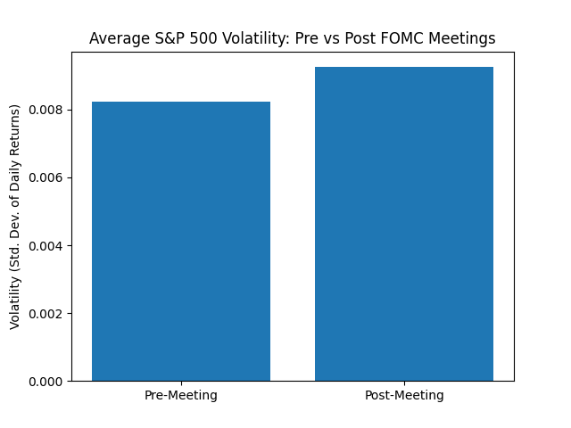
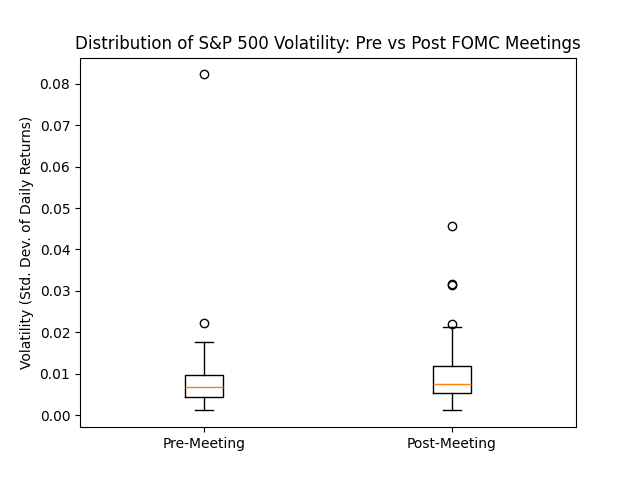

# FOMC Meetings and S&P 500 Volatility: An Event Study

## Summary

This study examines whether FOMC meetings affect the volatility of S&P 500 returns. Using data from 2014 to 2025, I identified 96 FOMC meetings and, for each, compared the standard deviation of daily returns in the 5 trading days before versus the 5 trading days after the meeting. A two-tailed Welch's t-test found no statistically significant difference between the two periods (p = 0.36). This suggests that markets may price in FOMC decisions efficiently, leaving no pronounced shift in short-term volatility around meetings.

## Motivation

FOMC meetings are among the most closely followed economic events today. Nearly every economic actor watches them, which makes every signal — from the rate decision to the Fed chair's remarks — potentially market-moving. Volatility, in turn, is a key indicator for investors worldwide: the higher the volatility of a financial instrument, the higher its risk. If FOMC meetings predictably affect market volatility, this would be valuable information for investors and risk managers. This study therefore analyzes the effect of FOMC meetings on the S&P 500 to test whether these meetings significantly move the market.

## Data & Methodology

For S&P 500 data, I used Yahoo Finance as my source (through the unofficial yfinance API). I examined the period from 2014 to 2025, during which 96 FOMC meetings took place. I extracted S&P 500 daily closing prices for this period and transformed them into daily returns using percentage change.

For each meeting, I created two event windows: the 5 trading days before the meeting and the 5 trading days after, and calculated the volatility (standard deviation of returns) of each window separately. I excluded the decision day itself and used only trading days, so that weekends and the event day would not distort the windows.

To compare the two samples, I applied a two-tailed Welch's t-test, which does not assume equal variances between the groups. The resulting p-value was 0.36, indicating no statistically significant difference between the pre- and post-meeting windows.

## Findings

The average pre-meeting volatility was 0.0082, while the average post-meeting volatility was 0.0092. This suggests that if there were a meaningful difference between the two samples, its direction would favor the post-meeting period. However, the two-tailed Welch's t-test returned a p-value of 0.36, indicating no statistically significant difference.

The bar chart above shows the visual difference between the two averages, with the post-meeting period appearing higher. However, note that the y-axis starts at zero and the actual difference is small (about 0.001), so the visual gap overstates the real difference.

The box plot tells a more complete story. The two distributions overlap substantially, and their medians are nearly identical — consistent with the non-significant test result. The small gap in averages seen in the bar chart stems largely from a few outliers in the post-meeting sample, rather than from a systematic shift in typical volatility.

## Interpretation & Limitations

The absence of a statistically significant difference suggests that markets may absorb FOMC decisions efficiently. If investors largely anticipate the Fed's decisions in advance, much of the information is priced in before the meeting, leaving no pronounced shift in short-term volatility once the decision is announced. Importantly, this conclusion rests on a relatively large sample of 96 meetings, which reduces the likelihood that a real effect was missed simply due to insufficient statistical power. A null result of this kind is itself informative: it indicates that FOMC meetings leave no clear footprint on the short-term daily volatility of the S&P 500.

This study has several limitations. First, it relies on daily closing data, whereas FOMC decisions are announced at 2:00 PM ET; the sharpest market reaction may occur intraday and be dampened by the daily close, meaning daily data could understate the true immediate effect. Second, the analysis examines only volatility (the dispersion of returns), not the direction of returns — it is possible that meetings systematically move the market up or down without changing its volatility. Third, all meetings are treated equally, while in reality anticipated decisions and surprise decisions may provoke very different reactions; distinguishing between them could reveal effects that are hidden when all meetings are pooled together.